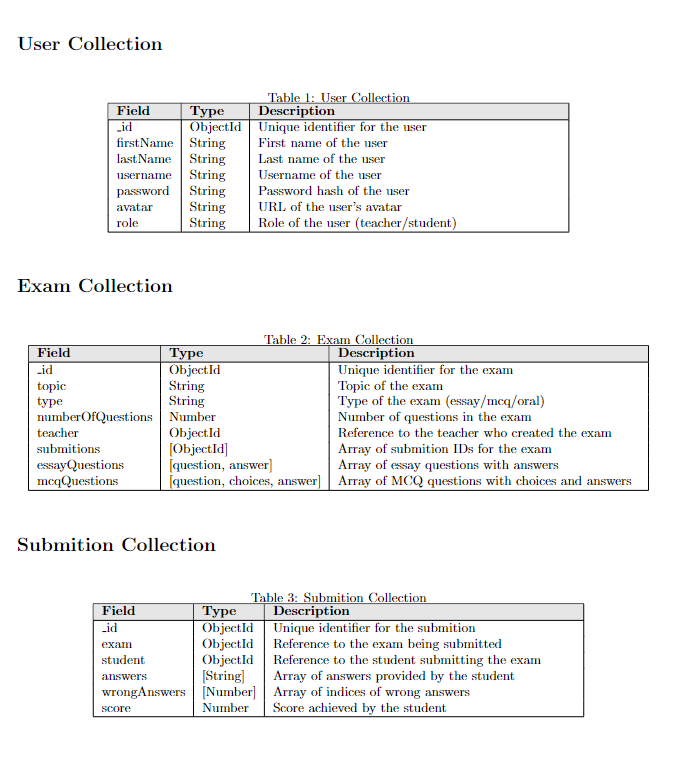

## Exam GPT Web Application
Exam GPT is designed to simplify the process of creating, managing, and conducting exams for teachers and students. The application leverages advanced technologies, including the OpenAI API, to enhance the exam generation and evaluation processes.

### Application Features:
- **Exam Creation:** User-friendly interface for teachers to specify exam details.
- **OpenAI Integration:** Use OpenAI API to generate exam content.
- **Exam Types:**
  - **MCQ:** Auto-grade and provide instant feedback.
  - **Essay:** Allow free-form text responses, uses AI for evaluation.
  - **Oral:** Implement voice recording and submission for teacher evaluation.
- **Time Limit:** Each exam has a duration, students not allowed to exceed it.
  - **Auto submission**: The exam form is automatically submitted when the time limit reaches zero seconds.
  - **Session Managment**: 
    - **If a student closes the exam form but hasn’t submitted and hasn't exceeded the time limit:** They can reopen the exam and continue answering.
    - **If a student hasn't submitted but has exceeded the time limit:** The student's submission is deleted, and they cannot reopen or continue the exam.
- **Download Exams Data:**
  - **Excel**: teachers and admins can download the exam data as an Excel sheet.
  - **zip**: teachers, admins and students can donwload the oral exam answers as a zip file.
- **Student Interface:** Simple and intuitive interface for exam access and submission.
- **Teacher Interface:** Dashboard for reviewing submissions, providing feedback, and grading.
- **Secure User Authentication:** Implement secure authentication methods.

### Teacher's Workflow:
1. **Login/Register:** Teachers can create accounts or log in.
2. **Create Exams:**
   - Specify exam details:
     - Topic
     - Number of questions
     - Type of exam (Essay, MCQ, Oral)
3. **Generate Exam Content:** Utilize OpenAI API to create exam questions and answer keys.
4. **Review Submissions:** For oral exams, listen to student recordings and provide evaluations.
5. **Download Exams data:**
   - Download data about the exam (student_id, username, full_name, score) as an excel sheet.
   - Download data about the oral exam submission (answers) as a zip file.

### Admin's Workflow:
1. **Login:** There's only one admin, so he can only login and users cannot create new admins.
2. **Manage Teachers:**
   - Viewing All the Teachers and their exams.
   -  Viewing All the Students and their submissions.
   -  Delete Teachers or Students.
3. Download the exam data as an excel sheet.
4. Download the Submission data as a zip file.

### Student's Workflow:
1. **Login/Register:** Students create accounts or log in.
2. **View Available Exams:** See exams created by teachers.
3. **Take Exams:**
   - For MCQ and Essay exams:
     - Answer questions directly in the web app.
     -  Receive instant feedback.
   - for Oral exams:
     - Record oral responses.
     -  Submit recordings for teacher evaluation.
5. **View Results:** Access results immediately after completing MCQ or Essay exams.

### Technologies:
- **Backend:** Nodejs, Express.js for server-side logic.
- **Frontend:** JavaScript/ejs/tailwindCSS for user interface.
- **Database:** MongoDB for data storage and mongoose as an ORM.
- **API Integration:** OpenAI API for exam content generation and evaluation.
- **User Authentication:** Use JWT for secure authentication.

### Database Diagram

